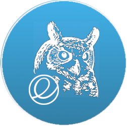
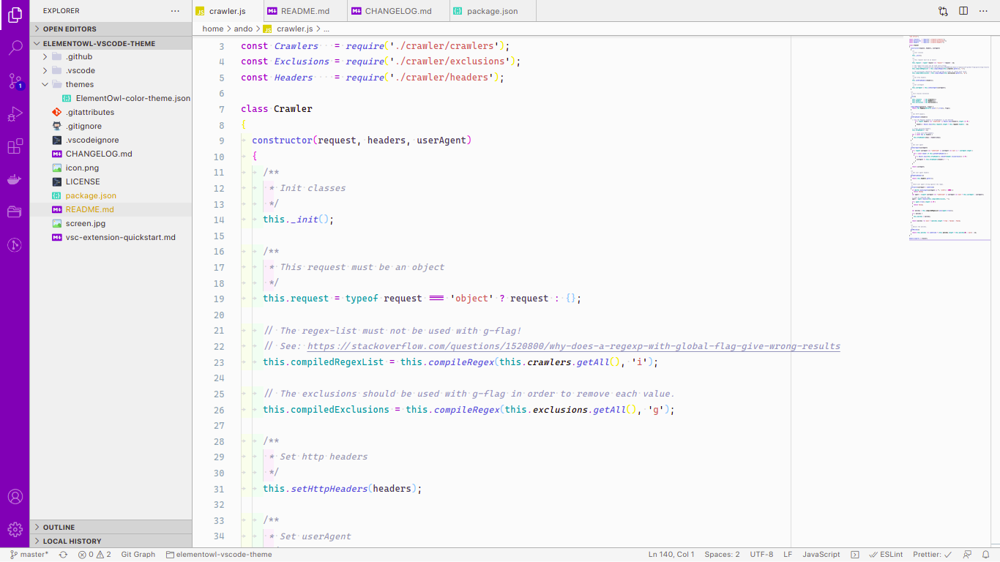

  

  <h3 align="center"><strong>ElementOwl Theme</strong></h3>

  

    <a href="https://elementary.io/">elementaryOS</a> theme for <a href="https://code.visualstudio.com/">VSCode</a>. Inspired by the fabulous <a href="https://github.com/sdras/night-owl-vscode-theme">Night Owl Theme</a> and <a href="https://github.com/electricduck/vscode-elementary-theme">elementary Theme</a>.
    <small><em>These are my custom workplace customizations inspired by both themes that I have decided to package into an VSCode theme</em>. Enjoy!</small>
  

  

    <code>ext install dre1080.elementowl</code>
     
    <a href="https://marketplace.visualstudio.com/items?itemName=dre1080.elementowl">Visual Studio Marketplace</a> &bull;
    <a href="https://open-vsx.org/extension/dre1080/elementowl">Open VSX</a>
  

  

    
  

